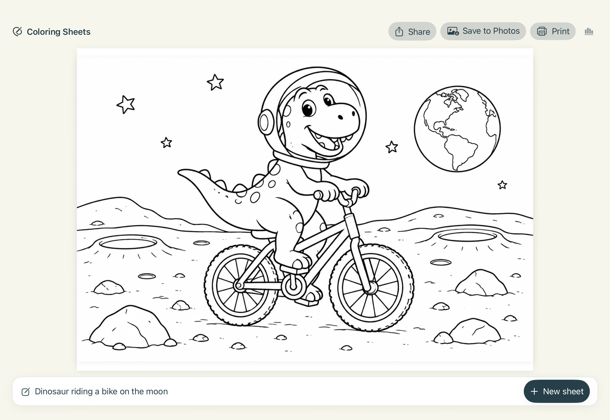

# Coloring Sheets for iPad

Native SwiftUI family prototype, targeting iPadOS 17+. The intended physical test device is a ninth-generation iPad running iPadOS 27. Open `ColoringSheets.xcodeproj` in Xcode and select the shared **ColoringSheets** scheme.



*Landscape iPad simulator capture. The example uses the prompt “Dinosaur riding a bike on the moon” and a generated demo illustration; no live request was sent.*

## Repository layout

```text
ColoringSheets/                 SwiftUI app source
ColoringSheetsTests/            App unit and opt-in integration tests
ColoringSheetsUITests/          Simulator swipe, navigation, and editing tests
Config/                         Checked-in defaults and ignored local overrides
Scripts/                        Project, configuration, and offline test tooling
workers/
  coloring-sheets-api/          Current Cloudflare Worker
    src/index.mjs               Worker entry point
    wrangler.jsonc              Worker-specific deployment configuration
```

Future Cloudflare Workers should be added as sibling directories under `workers/`, with their own source, Wrangler configuration, tests, and README. See `workers/README.md` for the convention.

## Start with the demo

Debug builds default to `COLORING_MODE = mock`. Choose an iPad simulator and press Run. Enter a description, select a child’s age, and tap **Make 5 demo sheets**. Five different sample flowers arrive progressively; their artwork and usage values are deterministic fixtures, with no network call or charge. The first launch has no assumed age. Subsequent launches restore the selected age locally.

The UI uses a bottom composer with a whole-year age menu from 3 to 18 and always generates with Sunburst. Each tap starts **five requests in parallel**, preserving the same description, age guidance, and landscape dimensions while giving each image a different composition preference: side, front, wide, close, or elevated view. These preferences preserve the subject and defer to explicit user instructions. All five prompts are validated against the 500 UTF-16-unit limit before any request starts; the editable description is never changed or truncated. New results are held for five seconds after the first successful image, then revealed together for browsing. If every request finishes sooner, the gallery updates immediately, including when some requests fail. Swipe left or right, or use the toolbar arrows, to choose a sheet. The counter shows the selected sheet among the available results. Share, Save to Photos, Print, and individual usage details all use that selected sheet. Usage also shows the sum of returned estimates for the gallery; missing or failed requests can still incur charges. Live batches use paid credit for all five images. A confirmed temporary rate limit is retried at most twice per sheet after the Worker-provided delay; credit and spend limits never retry.

Each landscape sheet fills the space above the composer. The composer stays above the on-screen keyboard and the complete image scales to the remaining space while typing; the text field retains focus. Done dismisses the keyboard. Minimize and Edit description collapse and reopen the composer without clearing the prompt or images. Revealing the new gallery automatically minimizes it unless the user is already typing a new description. New sheet clears only the description and preserves the gallery until the replacement images are revealed. Later arrivals append without changing the selected sheet. A partial failure leaves successful sheets available; a completely failed batch preserves the previous gallery. Stop waiting and backgrounding cancel all outstanding local requests, keep completed sheets, and ignore late responses. Only confirmed temporary rate limits retry, at most twice per sheet. Long text can move within the bounded field; the gallery pages horizontally without vertical page scrolling.

## Anonymous service account

The app contains only the HTTPS Worker origin. On first live use, it creates a random server account and stores a short-lived access token in the device Keychain. Concurrent requests share that registration. The client maps the Worker's `accountId` field explicitly and sends lowercase UUIDs for generation and recovery. No name, email address, Apple ID, or sign-in screen is involved. The Worker, not the app, applies the free daily generation allowance and records idempotent generation results. The configured free allowance is 1,000 images per account per UTC day (up to 200 full five-sheet batches). Reservations within an account run in order so concurrent requests cannot spend the same remaining allowance, and a duplicate in-flight generation ID returns its existing job without repeating the paid request.

## Deploy the updated Worker, then enable live mode

`workers/coloring-sheets-api/src/index.mjs` is the complete, dependency-free Cloudflare module Worker. Its adjacent `wrangler.jsonc` declares the required OpenAI and token-signing secrets, a Durable Object for account state, and R2 storage for temporary result recovery. See `workers/coloring-sheets-api/README.md` for the deployment prerequisites. Deploy the Worker before rebuilding/running the updated app in live mode. No Cloudflare deployment is performed automatically by this project.

The updated endpoint accepts dimensions in pixels:

```json
{
  "subject": "A friendly dinosaur riding a bicycle. Complexity: simple outlines.",
  "model": "gpt-image-2.5-flare",
  "width": 1408,
  "height": 992
}
```

The public contract is `POST /v1/installations`, then authenticated `POST /v1/generations` with a UUID `Idempotency-Key`. Both dimensions must be supplied together, as positive integers divisible by 16. Each edge must be at most 3,840 pixels, the aspect ratio must be between 1:3 and 3:1, and total pixels must be between 655,360 and 3,686,400. `GET /v1/generations/{id}` recovers a completed image after an interrupted response. Invalid dimensions return HTTP 400 before contacting OpenAI. See the [official OpenAI size documentation](https://developers.openai.com/api/docs/guides/image-generation#size-and-quality-options).

The live app writes service diagnostics to unified logging under subsystem `com.jordan.family.ColoringSheets`, category `WorkerClient`. Installation, generation, and recovery responses record HTTP status; failed JSON responses also record the Worker's validated `error.code`. Generation and recovery entries share the request UUID. Transport failures record the URL error number. Logs never include descriptions, bearer tokens, response bodies, or image bytes. Filter the connected iPad's Console by the subsystem to inspect a future failure.

Omitting both dimensions defaults to **1024 × 1456**, an approximation of A4 portrait. This keeps older app versions and the Worker's browser page compatible. Explicit dimensions are forwarded exactly as `size: "WIDTHxHEIGHT"`; the Worker does not resize, crop, or silently substitute a size. Quality stays `low`. Successful responses remain PNGs, with `requestedSize` and `size` in the optional `X-Generation-Metrics` header. `size` uses upstream metadata when supplied and otherwise falls back to the request; the app's Usage sheet also shows the actual decoded PNG dimensions.

The app defaults to **A4 landscape (297:210)** in either device orientation. Its preview fits that page inside the available layout and reserves the top toolbar space before generation. The native print sheet selects landscape from the generated image dimensions. It converts the fitted page's point dimensions to pixels using SwiftUI's display scale, scales proportionally to the supported pixel range, and rounds to 16-pixel increments. Consequently, generated aspect ratios approximate A4, with a small amount of white space possible when fitting them; images are never stretched or cropped. Tiny windows use the API's minimum pixel area and large displays use the Worker cap. This is display-based resolution, not a fixed 300-DPI print setting.

Sizing is captured on each deliberate Generate tap. Window rotation/resizing changes the next request, never triggers a paid regeneration, and never changes an in-flight request. While typing reduces the preview, generation sizing retains the allocation from before editing. `PageFormat` and `ColoringViewModel.pageFormat` own the policy; A4 portrait and square are also supported internally for a future app-side format picker. The Worker accepts those dimensions without another API change. The demo generator honors the same requested dimensions, and export keeps the original PNG bytes.

After confirming deployment, copy `Config/Local.example.xcconfig` to `Config/Local.xcconfig`, set `COLORING_MODE = live`, and enter your Apple development team ID if known. The local file is ignored. Rebuild and Run. The demo badge should disappear and the button should say **Generate 5 sheets**. Recipients will never enter a credential. The gallery uses five concurrent calls to the existing single-image endpoint. Composition preferences are included in the existing subject field and require no Worker changes. Deploy the rate-limit Worker update so the app can distinguish non-retryable account limits from temporary rate limits.

To force mock mode during development, set `COLORING_MODE = mock` or add the Debug launch argument `--mock`. Remove that argument before testing live behavior.

## Two deliberate live checks

1. Keep the app foregrounded. Use a synthetic description such as “A friendly dinosaur riding a bicycle in a garden,” age 3, and Flare. Tap Generate once and wait. Inspect the PNG and optional metrics. Save it explicitly if you want to compare it later.
2. Keep the same description, choose age 15, and Sunburst. Generate once. Inspect the detail level and verify the second model works. This two-request check covers both models and markedly different complexity guidance; because both age and model change, it does not isolate the effect of age alone. A controlled same-model comparison would require an additional purposeful paid generation.

Do not automatically retry a failure. A timeout, Stop waiting, loss of connection, or background interruption may still leave a charged server generation. Check usage before deciding to request another sheet. The API has no job lookup or idempotency support.

The `subject`, `model`, `width`, and `height` fields are sent. Numeric age stays local. The app appends deterministic complexity instructions to a fresh copy of the original description, validates the complete subject’s 500 UTF-16-unit limit and encoded JSON’s 4,096-byte limit, and never appends guidance back into the text field.

## Install on your iPad

1. Connect the iPad to the Mac with a cable, unlock it, and accept the normal Trust prompts.
2. In Xcode, open this project and select the **ColoringSheets** target → **Signing & Capabilities**. Enable automatic signing and choose your existing Apple team. If needed, add your Apple account through Xcode Settings → Accounts. Adjust the bundle identifier if your team requires a unique one. No account or signing settings were changed by this implementation.
3. Choose your physical iPad as the run destination. Enable Developer Mode on the iPad if Xcode requests it; follow the device’s restart/confirmation prompts.
4. Start with mock mode and press Run. Test both orientations, age persistence after relaunch, large text, keyboard dismissal, and window resizing.
5. Generate a demo PNG and exercise Share, Save to Photos, and Print. Open the saved PNG in Photos. Check that print preview retains the whole page and margins. Confirm actual output with your AirPrint printer.
6. Once deployed-source verification and the local secret are ready, switch to live mode, rebuild, and perform the deliberate checks above.

Apple’s device setup guide: https://developer.apple.com/documentation/xcode/running-your-app-on-simulated-or-physical-devices

## Offline checks

```sh
node Scripts/test_worker.mjs
python3 Scripts/test_configuration.py
xcodebuild -project ColoringSheets.xcodeproj -scheme ColoringSheets \
  -configuration Debug \
  -destination 'platform=iOS Simulator,name=iPad Pro 11-inch (M5)' \
  -derivedDataPath .build/DerivedData \
  COLORING_MODE=mock test
```

The offline XCTest cases cover model serialization, age guidance and persistence, UTF-16 validation, optional/malformed metrics, PNG validation, HTTP failures, single-request networking and timeouts, redirect refusal, duplicate-tap/lifecycle behavior, retained results, export bytes/cleanup, print fit, description-field identity/focus through keyboard presentation and dismissal, A4 sizing across layouts/display scales, resolution limits, and request-size capture across resizing. Synthetic inputs and dummy credentials only. The Worker check replaces upstream fetch completely and confirms forwarding for both models and two complexity variants, A4 defaults, custom portrait/landscape/square sizes, size metrics, and rejection of invalid dimensions before upstream calls. Build configuration checks use a dummy credential in a temporary directory and verify missing Release secrets fail without printing values.

`LiveIntegrationTests` is skipped in ordinary test runs. It requires a live build and the explicit test-host environment value `COLORING_EXPLICIT_LIVE_CHECK=two-generations`. The deliberate check sends Flare/simple and Sunburst/intricate once, stops if the first fails, and saves synthetic output PNGs in the simulator app’s Documents/LiveVerification directory. It creates an exclusive persistent claim before any network operation; a repeated run skips rather than sending more requests. Do not remove this claim or enable test repetitions to retry a failed paid generation. Inspect usage and make a new deliberate decision first. Never include this opt-in environment value in routine CI or the shared scheme.

Registration regression tests use synthetic `/v1` responses to check the exact JSON keys, one account for concurrent requests, Keychain persistence across clients, lowercase generation/recovery IDs, and ISO timestamps with fractional seconds. Keep normal simulator signing enabled so Keychain access works. `GalleryUITests.testExplicitLiveGeneration` is a separate opt-in device check: set `COLORING_EXPLICIT_LIVE_UI_CHECK=one-batch` in the generated test runner environment only when deliberately verifying paid generation. It taps Generate once and requires a real result in the gallery; do not enable test repetitions or add this flag to the shared scheme.

Batch coverage verifies that all five distinct composition requests start before any completes, invalid composition prompts prevent the entire batch from starting, duplicate taps cannot launch extra requests, the five-second reveal delay buffers early arrivals, batch completion reveals images immediately, out-of-order responses preserve selection, selected-image export retains the correct PNG bytes, partial and complete failures retain usable results, and cancellation ignores late results even after a new batch starts. It also verifies that only confirmed temporary rate limits retry, with a maximum of two retries. Landscape layout checks cover seven iPad screen shapes with expanded, focused, and minimized composers. `ColoringSheetsUITests` launches with `--mock` and exercises real left/right swipes, arrow navigation, end limits, and prompt editing without losing the selected page. The unit/layout and UI interaction checks passed in the simulator; no paid batch was generated for this change.

The project generator has no third-party dependencies. Run `python3 Scripts/create_project.py` after adding Swift source files; it rewrites the Xcode project and shared scheme. Keep local signing overrides in `Config/Local.xcconfig` so regeneration does not lose them.

## Verification status

- Xcode 27.0 (27A266a), iOS 27 simulator runtime available.
- Debug simulator build succeeded; eight XCTest cases passed, zero failures.
- Offline Worker and build-configuration checks passed. The live test was separately verified to skip without explicit opt-in. A privacy scan confirmed the real Worker credential is absent from project source and build/test logs.
- Two live simulator requests succeeded on 19 September 2026: Flare with simple guidance (9.669 seconds upstream) and Sunburst with intricate guidance (14.529 seconds). Both returned valid 1024 × 1536 PNGs. Each server estimate was $0.00539 USD, $0.01078 total; these are estimates, not billing receipts. No request was retried. Visually inspected outputs are in `.build/live-results/`; these generated artifacts are Git-ignored.
- Deployed-source wording was confirmed by the user. Live generation and visual comparison passed. The physical ninth-generation iPad on iPadOS 27 is paired and connected; a device-architecture build passed. Developer Mode and signing are configured, and the signed live app was installed on the iPad on 19 September 2026. The developer profile is trusted and the user confirmed the app runs and generates sheets on the physical iPad. This development provisioning profile expires on 26 September 2026 at 21:20 UTC, after which the app needs rebuilding/reinstallation. Physical-device launch and generation are confirmed by the user. Native export dialogs and actual AirPrint output still require verification. These device checks can wait; the simulator supports development and live API testing.

No app logs contain prompts, age, image bytes, authorization headers, or credentials. Usage values are optional server estimates, not a billing receipt. Stopping or backgrounding cancels local waiting only; there is no automatic request on resume.

Layout verification: mock result captures were inspected at 1080 × 786, 810 × 1056, and 500 × 700 points after removing main-page scrolling. The eight offline tests passed; the paid integration test was skipped. No live requests were sent for this layout change.

Keyboard regression: focusing the description previously replaced its parent view, disrupting the active responder. The layout now uses AnyLayout to preserve the field. The focus/type/dismiss/refocus test passed in both the iOS simulator and the physical ninth-generation iPad on 19 September 2026. This test uses a mock service and makes no paid request.

Image sizing update: ten offline XCTest cases passed, the paid integration test skipped, and Worker/build-configuration checks passed. The updated Worker has not been deployed and no paid generations were sent for this change. Earlier 1024 × 1536 live results above refer to the previous Worker.

Bottom composer update (20 September 2026): the app now requests A4 landscape pages, keeps the preview visible during editing, and minimizes the composer after a successful generation unless the user is typing. Fifteen offline XCTest cases passed, the paid integration test skipped, and Worker/configuration checks passed. Landscape simulator captures were inspected at the iPad 9, mini 6, iPad 10, 11-inch and 13-inch Air, and 11-inch and 13-inch Pro screen shapes, plus keyboard-focus and minimized states. No paid generation, Worker deployment, or physical-device installation was performed for this update. Live landscape generation requires the dimension-aware Worker update described above.

Physical iPad update (22 September 2026): built the bottom-composer version in live mode with the existing signing configuration, installed it on the paired ninth-generation iPad, and successfully launched it with devicectl. No paid generation or Worker deployment was performed during installation; the dimension-aware Worker deployment requirement above still applies.
