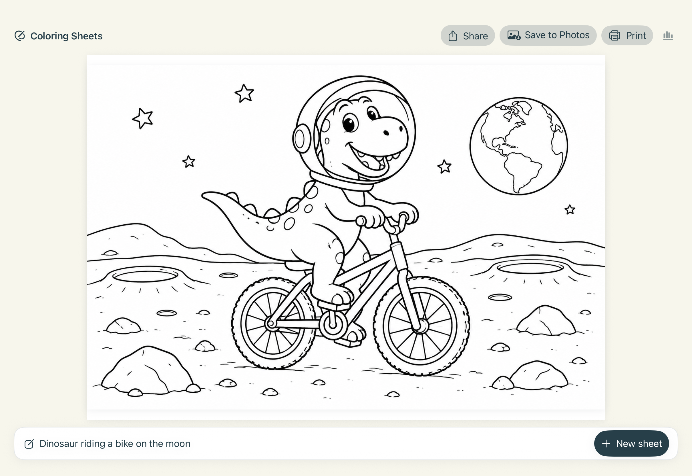

# WonderLines — Coloring Sheets for iPhone and iPad

Created by Jordan Erenrich.

Project page: https://jerenrich.github.io/WonderLines/

Universal native SwiftUI app, targeting iOS and iPadOS 17+. The intended physical test device is a ninth-generation iPad running iPadOS 27. Open `ColoringSheets.xcodeproj` in Xcode and select the shared **ColoringSheets** scheme.



*Landscape iPad simulator capture. The example uses the prompt “Dinosaur riding a bike on the moon” and a generated demo illustration; no live request was sent.*

## Repository layout

```text
ColoringSheets/                 SwiftUI app source
ColoringSheetsTests/            App unit and opt-in integration tests
ColoringSheetsUITests/          Simulator swipe, navigation, and editing tests
Config/                         Checked-in defaults and ignored local overrides
Scripts/                        Project, configuration, and offline test tooling
workers/
  coloring-sheets-api/          Current Cloudflare Worker
    src/index.mjs               Worker entry point
    wrangler.jsonc              Worker-specific deployment configuration
```

Future Cloudflare Workers should be added as sibling directories under `workers/`, with their own source, Wrangler configuration, tests, and README. See `workers/README.md` for the convention.

## Start with the demo

Debug builds default to `COLORING_MODE = mock`. Choose an iPhone or iPad simulator and press Run. Enter a description, choose an age difficulty in Settings, and tap **Make 3 demo sheets**. The Settings button in the toolbar lets you adjust age difficulty, choose from six image models (Flare, Sunburst, FLUX.2 Klein 4B, FLUX.2 Klein 9B, Phoenix 1.0, and ColoringBook.Redmond V2), and select 1–3 images per generation. These settings are saved locally; the defaults are Sunburst and three images. Sample flowers arrive progressively, with no network call or charge. The first launch has no assumed age. Subsequent launches restore the selected age locally.

The UI uses a bottom composer and a whole-year age difficulty slider from 3 to 18 in Settings. Younger ages produce simpler shapes and larger coloring areas; older ages add finer details. The age reminder opens Settings directly. Each tap starts **1–3 requests in parallel** with the selected model, preserving the same description, age guidance, and landscape dimensions while giving each image a different composition preference in this order: side, front, wide. These preferences preserve the subject and defer to explicit user instructions. Every prompt is validated against the 500 UTF-16-unit limit before any request starts; the editable description is never changed or truncated. Settings changed during a batch apply to the next one. New results are held for five seconds after the first successful image, then revealed together for browsing. If every request finishes sooner, the gallery updates immediately, including when some requests fail. Swipe left or right, or use the toolbar arrows, to choose a sheet. The counter shows the selected sheet among the available results. Share, Save to Photos, Print, and individual usage details all use that selected sheet. Usage also shows the sum of returned estimates for the gallery; missing or failed requests can still incur charges. Live batches use paid credit for each image requested.

Each landscape sheet fills the space above the compact composer. The description box keeps a steady two-line height, and its placeholder disappears when focused. A muted teal accent highlights the main action. The composer stays above the on-screen keyboard and the complete image scales to the remaining space while typing; the text field retains focus. The keyboard button dismisses the keyboard. Minimize and Edit description collapse and reopen the composer without clearing the prompt or images. Generating sheets keeps the same compact text field available, so one tap resumes typing without first expanding the composer. Manually reopening a minimized description also opens the keyboard immediately. New sheet clears only the description and preserves the gallery until the replacement images are revealed. Later arrivals append without changing the selected sheet. A partial failure leaves successful sheets available; a completely failed batch preserves the previous gallery. Stop waiting cancels outstanding local waits, keeps completed sheets, and ignores late responses. Locking or switching apps keeps the original requests alive and preserves their counters. Before device verification and submission, the live client requests a bounded UIKit background window and ends it as soon as the POST returns or fails; polling does not hold that window. Every live model retains unfinished generation IDs for recovery. On return, in-flight submission/poll tasks continue and any polling delays are woken immediately for all sheets. An already-running generation upload is retained. In-flight recovery GETs are cancelled and replaced with fresh read-only requests on return, so a connection stranded by suspension cannot hold the gallery behind its network timeout. A foreground event during a GET also skips its following delay. Interrupted and recovered batches display each received sheet immediately, without the initial five-second reveal window used for a new foreground batch. If those tasks fail after resuming, the app automatically checks saved IDs from the interrupted batch. Relaunch also recovers that saved batch. If none of its sheets had arrived, its first recovered result replaces the previous gallery; otherwise recovery appends to that batch and preserves the selected sheet. Repeated locks retain that behavior, and server generation IDs prevent duplicate sheets. The explicit unfinished-sheets button can recover older batches; Stop waiting remains manual. The current gallery, selected sheet, buffered results, and interrupted batch context are saved atomically in the app’s private Application Support directory. A successful download keeps its recovery ID until this local save succeeds, closing the cancellation handoff gap. Each successful snapshot clears recovery IDs for every saved sheet, including sheets retained after an earlier save failure, and clears any obsolete save warning. Failed local saves are also retried when backgrounding or returning to the app, even after the batch has finished. Relaunch also clears IDs for images saved just before termination interrupted that acknowledgement. Relaunch restores the gallery and automatically recovers only the unfinished part of that batch; Stop waiting survives relaunch. Local snapshots contain PNGs and opaque generation metadata, not descriptions or credentials. Recovery makes up to 120 read-only polls, checking confirmed processing jobs every five seconds (roughly ten minutes for responsive jobs); a temporarily missing reservation gets at most six checks within the minute after its ID was saved, and an already-old missing ID fails on its first check. Recovery shows “Checking”, including when returning to an original in-flight batch. Foreground diagnostics record the wake and the next server response even when the processing state is unchanged. New live builds request API version 2, which queues every provider in a Durable Object alarm so drawing continues independently of the phone connection. Legacy clients retain the synchronous protocol for non-fal models. A generation POST is never automatically repeated; recovery only polls the existing job. Long text can move within the bounded field; the gallery pages horizontally without vertical page scrolling.

Recovery validation on 6 October 2026: all 67 app tests completed with five skips and zero failures. The added lifecycle regression verifies that a completed gallery retries a temporary local save failure on both backgrounding and resume, clears its recovery ID only after saving, and makes no additional generation or recovery request.

## Shared iPhone and iPad app

Both devices use the same **ColoringSheets** target, bundle identifier, SwiftUI views, view model, networking, settings, and export code. Select either device in the existing scheme; no second app target or copied source tree is needed. Saved preferences and anonymous service identity remain local to each installation; this does not add cross-device sync.

The layout adapts to available space, including iPad multitasking. Compact windows put Share, Save to Photos, Print, and Usage in the **Sheet actions** menu beside the gallery arrows. Wider windows keep the direct toolbar buttons. Usage adapts to a sheet on compact displays. Both phone orientations are supported, while generated sheets retain the shared A4 landscape policy. In short windows while typing, the editor takes priority over the gallery toolbar; the composer can scroll when the keyboard or accessibility text leaves insufficient space. Dismissing the keyboard restores the gallery controls without losing the description or selected sheet. Printing uses the native phone presentation on iPhone and an anchored popover on iPad.

Device-family and orientation settings live in `Scripts/create_project.py`; regenerate the project after changing them so iPhone support survives regeneration. To run the same offline suite on a phone:

```sh
xcodebuild -project ColoringSheets.xcodeproj -scheme ColoringSheets \
  -configuration Debug \
  -destination 'platform=iOS Simulator,name=iPhone 17e' \
  -derivedDataPath .build/DerivedData \
  COLORING_MODE=mock test
```

The portrait UI regression covers generation, gallery selection, compact export actions, the Usage sheet, and editing through rotation with the keyboard open. Run it alongside the existing landscape interaction and shared logic tests on both device families. To install on an iPhone, follow the device installation steps below using your iPhone as the run destination.

Verification (22 September 2026): the universal app builds for iPhone and iPad. Shared unit tests, keyboard-focus tests, and UI checks passed on iPhone 17e and iPad Pro 11-inch (M5) simulators, including portrait, landscape, rotation, and accessibility text. iPad window fixtures run only on iPad scenes. One iPad swipe assertion failed during concurrent simulator runs and passed in an isolated rerun. Phone gallery, keyboard, and Usage screenshots were inspected. All generation used mock mode; physical iPhone installation and native export/printer output remain unverified.

## Anonymous service account

The app contains only the HTTPS Worker origin. On first live use, it creates a random server account and stores a short-lived access token in the device Keychain. Concurrent requests share that registration. The client maps the Worker's `accountId` field explicitly and sends lowercase UUIDs for generation and recovery. No name, email address, Apple ID, or sign-in screen is involved. The Worker, not the app, applies the free daily generation allowance and records idempotent generation results. The configured free allowance is 100 images per account per UTC day, resetting at midnight UTC (33 full three-sheet batches plus one image). Reservations within an account run in order so concurrent requests cannot spend the same remaining allowance, and a duplicate in-flight generation ID returns its existing job without repeating the paid request.

Tokens authorize generation for 30 days. `POST /v1/installations/renew` renews the signed device credential for the same account, including after expiry, only after checking its signature and the account’s current credential ID. Expired credentials remain invalid for generation and recovery until renewed. Revoking the account credential also blocks renewal. The app shares renewal across concurrent requests and keeps the existing Keychain entry if renewal fails; it never registers a replacement account in response to expiry. The Keychain credential therefore provides ongoing renewal access until revoked; losing that device credential is not recoverable through a sign-in flow.

Deploy the Worker with the renewal endpoint before distributing this updated app. Against an older Worker, an expired account will remain saved and generation will report a configuration error instead of silently replacing the account. The renewal Worker was deployed on 23 September 2026 as version `742dc241-7c55-4c6c-afa7-b930011c790e`; That deployment was subsequently superseded by the AI Gateway deployment documented in the Worker README. The offline renewal tests passed. The deployed renewal route was verified with an invalid credential and returned its expected HTTP 401 JSON response. Cloudflare rejects the default `Python-urllib/3.9` User-Agent with error 1010; curl and Python using `ColoringSheets-DeploymentCheck/1.0` both reach the Worker. Changing only that header reproduces/removes the rejection. Use an explicit deployment-check User-Agent for Python checks. Authenticated renewal remains covered by offline tests; no paid generation was sent.

## Deploy the updated Worker, then enable live mode

`workers/coloring-sheets-api/src/index.mjs` is the dependency-free Cloudflare module Worker, with provider routing in `src/image-provider.mjs`. It supports Cloudflare AI Gateway with your existing OpenAI key, Gateway-stored BYOK, configurable OpenAI/Gemini image routes, and nine Cloudflare-hosted FLUX, Leonardo, Stable Diffusion, and DreamShaper options through Workers AI. Direct OpenAI remains the default until Gateway is configured. Its adjacent `wrangler.jsonc` declares the token-signing secret, Durable Objects for account state and the global budget, and R2 storage for temporary result recovery. See `workers/coloring-sheets-api/README.md` for the deployment prerequisites. Deploy the Worker before rebuilding/running the updated app in live mode. No Cloudflare deployment is performed automatically by this project.

The updated endpoint accepts dimensions in pixels:

```json
{
  "subject": "A friendly dinosaur riding a bicycle. Complexity: simple outlines.",
  "model": "gpt-image-2.5-flare",
  "width": 1408,
  "height": 992
}
```

The public contract is `POST /v1/installations`, then authenticated `POST /v1/generations` with a UUID `Idempotency-Key`. Both dimensions must be supplied together, as positive integers divisible by 16. Each edge must be at most 3,840 pixels, the aspect ratio must be between 1:3 and 3:1, and total pixels must be between 655,360 and 3,686,400. `GET /v1/generations/{id}` recovers a completed image after an interrupted response. Invalid dimensions return HTTP 400 before contacting an image provider. See the [official OpenAI size documentation](https://developers.openai.com/api/docs/guides/image-generation#size-and-quality-options).

The live app writes service diagnostics to unified logging under subsystem `com.jordan.family.ColoringSheets`, category `WorkerClient`. Installation, generation, and recovery responses record HTTP status; failed JSON responses also record the Worker's validated `error.code`. Generation and recovery entries share the request UUID. Transport failures record the URL error number. Logs never include descriptions, bearer tokens, response bodies, or image bytes. Filter the connected iPad's Console by the subsystem to inspect a future failure.

Omitting both dimensions defaults to **1024 × 1456**, an approximation of A4 portrait. This keeps older app versions and the Worker's browser page compatible. For OpenAI routes, explicit dimensions are forwarded exactly as `size: "WIDTHxHEIGHT"`; the Worker does not resize, crop, or silently substitute a size. Quality stays `low`. Successful responses remain PNGs, with `requestedSize` and `size` in the optional `X-Generation-Metrics` header. `size` reports dimensions read from the returned PNG; Cloudflare-hosted routes fit dimensions to each model’s limit and convert JPEG to PNG as needed (Schnell uses its fixed native size); Gemini routes select the nearest supported aspect ratio at the model’s default resolution; the app's Usage sheet also shows the actual decoded PNG dimensions.

The app defaults to **A4 landscape (297:210)** in either device orientation. Its preview fits that page inside the available layout and reserves the top toolbar space before generation. The native print sheet selects landscape from the generated image dimensions. It converts the fitted page's point dimensions to pixels using SwiftUI's display scale, scales proportionally to the supported pixel range, and rounds to 16-pixel increments. Consequently, generated aspect ratios approximate A4, with a small amount of white space possible when fitting them; images are never stretched or cropped. Tiny windows use the API's minimum pixel area and large displays use the Worker cap. This is display-based resolution, not a fixed 300-DPI print setting.

Sizing is captured on each deliberate Generate tap. Window rotation/resizing changes the next request, never triggers a paid regeneration, and never changes an in-flight request. While typing reduces the preview, generation sizing retains the allocation from before editing. `PageFormat` and `ColoringViewModel.pageFormat` own the policy; A4 portrait and square are also supported internally for a future app-side format picker. The Worker accepts those dimensions without another API change. The demo generator honors the same requested dimensions, and export keeps the original PNG bytes.

After confirming deployment, copy `Config/Local.example.xcconfig` to `Config/Local.xcconfig`, set `COLORING_MODE = live`, and enter your Apple development team ID if known. The local file is ignored. Rebuild and Run. The button should say **Generate 3 sheets** at the default setting. Recipients will never enter a credential. The gallery uses 1–3 concurrent calls to the existing single-image endpoint. The selected model ID is sent in each request and the Worker resolves it through its configured model routes. See [AI Gateway setup and model experiments](workers/coloring-sheets-api/README.md#enable-ai-gateway-using-your-current-openai-credits) for configuration, Cloudflare billing, and adding custom routes. Rebuild the app to see the six available choices in Settings → Model. See the [model comparison and rollout notes](workers/coloring-sheets-api/README.md#cloudflare-hosted-image-models) for each option's image-size behavior. Composition preferences are included in the existing subject field.

To force mock mode during development, set `COLORING_MODE = mock` or add the Debug launch argument `--mock`. Remove that argument before testing live behavior.

## Two deliberate live checks

1. Keep the app foregrounded. Use a synthetic description such as “A friendly dinosaur riding a bicycle in a garden,” age 3, and Flare. Tap Generate once and wait. Inspect the PNG and optional metrics. Save it explicitly if you want to compare it later.
2. Keep the same description, choose age 15, and Sunburst. Generate once. Inspect the detail level and verify the second model works. This two-request check covers both models and markedly different complexity guidance; because both age and model change, it does not isolate the effect of age alone. A controlled same-model comparison would require an additional purposeful paid generation.

Do not automatically retry a failure. A timeout, Stop waiting, loss of connection, or background interruption may still leave a charged server generation. Check usage before deciding to request another sheet. The API supports idempotent generation IDs and read-only job recovery; a new Generate tap creates new requests.

The `subject`, `model`, `width`, and `height` fields are sent. Numeric age stays local. The app appends deterministic complexity instructions to a fresh copy of the original description, validates the complete subject’s 500 UTF-16-unit limit and encoded JSON’s 4,096-byte limit, and never appends guidance back into the text field.

## Install on your iPad

If a live generation fails, the message now appears below the editor. Tap **Diagnostics** beside the failure, or open **Settings → Diagnostics**, to see up to 300 connection and service events from the last seven days with timestamps, generation IDs, request stages, HTTP statuses, and Worker error codes. **Share report** exports the same metadata for debugging. The report omits descriptions, images, credentials, request bodies, and raw server responses. Events stay on the device across app restarts. Routine events are persisted in groups over one second; failures, batch/recovery summaries, and backgrounding flush immediately. A sudden termination may lose the last second of routine events. Reports include app version/build, iOS version, live/mock mode, and diagnostic format version. Random batch IDs link related events; batch summaries include success/failure/unfinished counts, elapsed time, and whether waiting stopped because of the user or backgrounding. Recovery records state changes and a final summary rather than every identical polling response. Invalid image responses use fixed validation reasons without logging response contents. A secure device verification failure is identified before a generation POST is sent.

1. Connect the iPad to the Mac with a cable, unlock it, and accept the normal Trust prompts.
2. In Xcode, open this project and select the **ColoringSheets** target → **Signing & Capabilities**. Enable automatic signing and choose your existing Apple team. If needed, add your Apple account through Xcode Settings → Accounts. Adjust the bundle identifier if your team requires a unique one. No account or signing settings were changed by this implementation.
3. Choose your physical iPad as the run destination. Enable Developer Mode on the iPad if Xcode requests it; follow the device’s restart/confirmation prompts.
4. Start with mock mode and press Run. Test both orientations, age persistence after relaunch, large text, keyboard dismissal, and window resizing.
5. Generate a demo PNG and exercise Share, Save to Photos, and Print. Open the saved PNG in Photos. Check that print preview retains the whole page and margins. Confirm actual output with your AirPrint printer.
6. Once deployed-source verification and the local secret are ready, switch to live mode, rebuild, and perform the deliberate checks above.

Apple’s device setup guide: https://developer.apple.com/documentation/xcode/running-your-app-on-simulated-or-physical-devices

## Offline checks

```sh
node Scripts/test_worker.mjs
python3 Scripts/test_configuration.py
xcodebuild -project ColoringSheets.xcodeproj -scheme ColoringSheets \
  -configuration Debug \
  -destination 'platform=iOS Simulator,name=iPad Pro 11-inch (M5)' \
  -derivedDataPath .build/DerivedData \
  COLORING_MODE=mock test
```

The offline XCTest cases cover model serialization, age guidance and persistence, UTF-16 validation, optional/malformed metrics, PNG validation, HTTP failures, single-request networking and timeouts, redirect refusal, duplicate-tap/lifecycle behavior, retained results, export bytes/cleanup, print fit, description-field identity/focus through keyboard presentation and dismissal, A4 sizing across layouts/display scales, resolution limits, and request-size capture across resizing. Synthetic inputs and dummy credentials only. The Worker check replaces upstream fetch completely and confirms forwarding for both models and two complexity variants, A4 defaults, custom portrait/landscape/square sizes, size metrics, and rejection of invalid dimensions before upstream calls. Build configuration checks use a dummy credential in a temporary directory and verify missing Release secrets fail without printing values.

`LiveIntegrationTests` is skipped in ordinary test runs. It requires a live build and the explicit test-host environment value `COLORING_EXPLICIT_LIVE_CHECK=two-generations`. The deliberate check sends Flare/simple and Sunburst/intricate once, stops if the first fails, and saves synthetic output PNGs in the simulator app’s Documents/LiveVerification directory. It creates an exclusive persistent claim before any network operation; a repeated run skips rather than sending more requests. Do not remove this claim or enable test repetitions to retry a failed paid generation. Inspect usage and make a new deliberate decision first. Never include this opt-in environment value in routine CI or the shared scheme.

Registration regression tests use synthetic `/v1` responses to check the exact JSON keys, one account for concurrent requests, Keychain persistence across clients, lowercase generation/recovery IDs, and ISO timestamps with fractional seconds. Keep normal simulator signing enabled so Keychain access works. `GalleryUITests.testExplicitLiveGeneration` is a separate opt-in device check: set `COLORING_EXPLICIT_LIVE_UI_CHECK=one-batch` in the generated test runner environment only when deliberately verifying paid generation. It taps Generate once and requires a real result in the gallery; do not enable test repetitions or add this flag to the shared scheme.

Batch coverage verifies that all three distinct composition requests start before any completes, invalid composition prompts prevent the entire batch from starting, duplicate taps cannot launch extra requests, the five-second reveal delay buffers early arrivals, batch completion reveals images immediately, out-of-order responses preserve selection, selected-image export retains the correct PNG bytes, partial and complete failures retain usable results, and cancellation ignores late results even after a new batch starts. It also verifies that recovery keeps the same generation ID and does not repeat a paid POST. Landscape layout checks cover seven iPad screen shapes with expanded, focused, and post-generation composers. `ColoringSheetsUITests` launches with `--mock` and exercises real left/right swipes, arrow navigation, end limits, and prompt editing without losing the selected page. The unit/layout and UI interaction checks passed in the simulator; no paid batch was generated for this change.

The project generator has no third-party dependencies. Run `python3 Scripts/create_project.py` after adding Swift source files; it rewrites the Xcode project and shared scheme. Keep local signing overrides in `Config/Local.xcconfig` so regeneration does not lose them.

## Verification status

- Xcode 27.0 (27A266a), iOS 27 simulator runtime available.
- Debug simulator build succeeded; eight XCTest cases passed, zero failures.
- Offline Worker and build-configuration checks passed. The live test was separately verified to skip without explicit opt-in. A privacy scan confirmed the real Worker credential is absent from project source and build/test logs.
- Two live simulator requests succeeded on 19 September 2026: Flare with simple guidance (9.669 seconds upstream) and Sunburst with intricate guidance (14.529 seconds). Both returned valid 1024 × 1536 PNGs. Each server estimate was $0.00539 USD, $0.01078 total; these are estimates, not billing receipts. No request was retried. Visually inspected outputs are in `.build/live-results/`; these generated artifacts are Git-ignored.
- Deployed-source wording was confirmed by the user. Live generation and visual comparison passed. The physical ninth-generation iPad on iPadOS 27 is paired and connected; a device-architecture build passed. Developer Mode and signing are configured, and the signed live app was installed on the iPad on 19 September 2026. The developer profile is trusted and the user confirmed the app runs and generates sheets on the physical iPad. This development provisioning profile expires on 26 September 2026 at 21:20 UTC, after which the app needs rebuilding/reinstallation. Physical-device launch and generation are confirmed by the user. Native export dialogs and actual AirPrint output still require verification. These device checks can wait; the simulator supports development and live API testing.

No app logs contain prompts, age, image bytes, authorization headers, or credentials. Usage values are optional server estimates, not a billing receipt. Stop waiting cancels local waits. Backgrounding preserves submission and polling tasks; returning or relaunching may automatically read an existing job, without creating another generation.

Layout verification: mock result captures were inspected at 1080 × 786, 810 × 1056, and 500 × 700 points after removing main-page scrolling. The eight offline tests passed; the paid integration test was skipped. No live requests were sent for this layout change.

Lock/submission verification (5 October 2026): 59 simulator unit tests completed with five skipped and no failures, covering retained background submissions, late transport failures after foregrounding, age-bounded missing-job recovery, batch replacement, and persisted gallery handoff. A simulator UI test backgrounds three slow mock requests, returns, and verifies all three sheets with no remaining progress indicator. The physical iPhone run received its sheets and cleared progress, but its original counter assertion used the wrong accessibility label; the corrected rerun was blocked by the locked device. The fixed live configuration was installed on J17. An actual live generation followed by physical screen locking remains unverified.

Immediate foreground follow-up: 62 simulator unit tests completed with five skipped and no failures, and the background UI test passed. New tests wake three stalled polling delays together without a POST, skip the next delay when foregrounding occurs during a GET, preserve explicit cancellation, and display a single completed sheet promptly while the other two remain pending. The updated live build was installed on J17; these checks used synthetic images and made no paid generation requests.

Resume-label/polling follow-up: device logs from the latest real batch showed three POSTs accepted before backgrounding, subsequent processing responses, and exactly three saved sheets after about 86 seconds. The provider saved its final two results roughly 12 seconds before the app's next poll. Original tasks now show “Checking” on return and processing polls remain five seconds apart, retaining the roughly ten-minute polling budget. The 62 unit tests (five skipped) passed, and the strengthened background UI test passed on J17: it verifies “Checking” while results are still pending, then waits for all three sheets and completion. The same UI test passed in the simulator. Device verification used mock images, with no paid requests, before restoring the live app.

Keyboard regression: focusing the description previously replaced its parent view, disrupting the active responder. The layout now uses AnyLayout to preserve the field. The focus/type/dismiss/refocus test passed in both the iOS simulator and the physical ninth-generation iPad on 19 September 2026. This test uses a mock service and makes no paid request.

Image sizing update: ten offline XCTest cases passed, the paid integration test skipped, and Worker/build-configuration checks passed. The updated Worker has not been deployed and no paid generations were sent for this change. Earlier 1024 × 1536 live results above refer to the previous Worker.

Bottom composer update (20 September 2026): the app now requests A4 landscape pages, keeps the preview visible during editing, and minimizes the composer after a successful generation unless the user is typing. Fifteen offline XCTest cases passed, the paid integration test skipped, and Worker/configuration checks passed. Landscape simulator captures were inspected at the iPad 9, mini 6, iPad 10, 11-inch and 13-inch Air, and 11-inch and 13-inch Pro screen shapes, plus keyboard-focus and minimized states. No paid generation, Worker deployment, or physical-device installation was performed for this update. Live landscape generation requires the dimension-aware Worker update described above.

Physical iPad update (22 September 2026): built the bottom-composer version in live mode with the existing signing configuration, installed it on the paired ninth-generation iPad, and successfully launched it with devicectl. No paid generation or Worker deployment was performed during installation; the dimension-aware Worker deployment requirement above still applies.


### ColoringBook.Redmond V2 (fal.ai)

Settings → Model includes **ColoringBook.Redmond V2 (Beta)**. It uses SDXL with the Redmond coloring-book LoRA through the existing Worker and AI Gateway. Sunburst remains the default. Activation requires the Worker secret `FAL_KEY`, the dashboard variable `FAL_DAILY_GENERATION_LIMIT`, and deployment of the updated Worker before installing the app. See [fal setup, recovery and comparison](workers/coloring-sheets-api/README.md#coloringbookredmond-v2-on-falai).

Redmond sheets may wait in a queue. The Worker continues processing after the app closes. **Check unfinished sheets** retrieves pending Redmond jobs after interruption or relaunch without generating or charging for another sheet. Pending IDs are retained locally for 24 hours; server recovery runs for up to 30 minutes. An interrupted submission without a saved provider ID cannot be retried automatically. Usage shows provider-reported costs when available, otherwise estimates with their evidence. Redmond stores billing units, live unit pricing and inference timing; when billable units are absent it labels the inference-time proxy and possible additional overhead.

## App Store submission audit

The [submitted App Store baseline](docs/app-store/README.md) preserves the exact Apple listing, privacy and age-rating declarations, pricing, review notes, uploaded screenshots and build identifiers. Review it before changing app or backend behavior for a new release. Run `python3 Scripts/audit_app_store.py --include-working-tree` to verify the archived files and flag source changes for declaration review.

Batch description moderation: updated app batches send the original user description with a shared random batch ID, age, and a bounded composition choice. The server checks that original description once for concurrent requests and adds trusted complexity/composition guidance itself. Each image still generates in parallel after approval. Moderation decisions are shared for ten minutes per batch; a fresh Generate action uses a fresh batch ID. Older apps retain full-prompt moderation. The updated Worker must be deployed before installing this client.

Moderation diagnostics: rejected descriptions show possible flagged categories and a rewrite suggestion, while safety-service outages ask the user to try later. Both confirm no allowance was used. The app displays the complete error text and records a dedicated Content moderation event with fixed reason codes, HTTP status, batch/generation IDs, and the Worker code. Descriptions, raw responses, and probability scores stay out of shared reports. Moderation outages remove pending recovery entries because no image job was created. Worker audit events also include the gateway, elapsed time, and a fixed failure category, with numeric upstream codes where available.

Full recovery review: the latest iPhone trace sent its foreground checks 9 ms after activation and received processing responses about 120 ms later. The review found that the timer-only wake did not restart a hanging GET, and that server completion waited for optional fal billing metadata. Regression tests now hold an actual URLSession GET indefinitely and verify that foregrounding replaces it promptly without cancelling or repeating a pending POST; explicit Stop still cancels the read. Server tests hold billing requests and verify that the public API already serves the completed image, with the prompt removed from its saved job. The full app suite passed 64 tests with five skipped; offline Worker, batch moderation and configuration tests passed. These tests make no paid generation requests.
